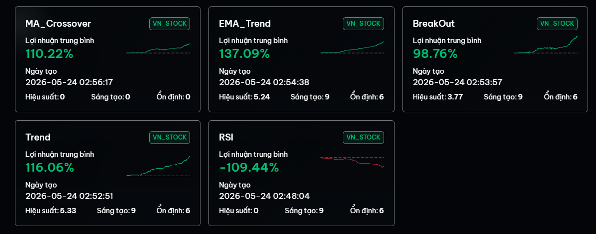

# BÁO CÁO TỰ ĐÁNH GIÁ HIỆU SUẤT HỆ THỐNG ĐA CHIẾN LƯỢC (MULTI-STRATEGY EVALUATION)

* **Học viên:** Nguyễn Trí Cao
* **Email:** kaitokao1412@gmail.com
* **Dự án:** QuantVN Entry Test
* **Repository:** [quantvn-vn-markets](https://github.com/KaitoKidKao/quantvn-vn-markets)

---

## 1. Đặt vấn đề và Phương pháp tiếp cận

Để chuẩn bị cho bài test đầu vào này và cũng là để tự mình hiểu rõ hơn về cách vận hành của thị trường chứng khoán Việt Nam, tôi quyết định không chỉ làm một chiến lược duy nhất. Thay vào đó, tôi đã xây dựng và chạy thử nghiệm **5 bot với các chiến lược khác nhau** – chia làm hai nhóm chính là Theo xu hướng (Trend Following) và Đảo chiều (Mean Reversion). Mục tiêu là để có số liệu đối chiếu thực tế xem mỗi góc nhìn sẽ "sống sót" ra sao trên nền tảng QuantVN.

Toàn bộ dữ liệu backtest được lấy trong giai đoạn từ **13-08-2018 đến 30-12-2022**.

---

## 2. Kết quả thu được từ Platform

Dưới đây là bảng số liệu thực tế tôi ghi nhận lại từ Dashboard sau khi chạy kiểm thử:

| Hạng | Tên chiến lược | Lợi nhuận trung bình | Điểm Hiệu suất | Điểm Sáng tạo | Điểm Ổn định | Đặc tính chiến lược |
| :---: | :--- | :---: | :---: | :---: | :---: | :--- |
| **1** | **EMA_Trend** | **+137.09%** | **5.24** | **9.0** | **6.0** | Xu hướng trung hạn (Đường EMA 50) |
| **2** | **Trend (Following)** | **+116.06%** | **5.33** | **9.0** | **6.0** | Xu hướng dài hạn (SMA 100 + SMA 20) |
| **3** | **MA_Crossover** | **+110.22%** | *Đang xử lý* | *Đang xử lý* | *Đang xử lý* | Xu hướng trung hạn (MA 20 / MA 50) |
| **4** | **BreakOut** | **+98.76%** | **3.77** | **9.0** | **6.0** | Đột phá hộp Donchian 20 phiên |
| **5** | **RSI** | **-109.44%** | **0.00** | **9.0** | **6.0** | Đảo chiều ngắn hạn (RSI 14) |

---

## 3. Phân tích chi tiết góc nhìn cá nhân

### 3.1. Nhóm bám theo xu hướng (EMA_Trend, Trend Following, MA_Crossover, BreakOut)
Nhìn chung, các chiến lược ăn theo sóng dài đều cho kết quả dương khá tốt, cụ thể:
* **EMA_Trend (+137.09%)**: Đây là bot ăn đậm nhất. Việc dùng đường EMA 50 giúp bot nhạy với giá hơn, nhận diện sóng tăng sớm hơn một chút và khi thị trường quay đầu thì nó cũng cắt lệnh kịp thời hơn, giữ được lợi nhuận.
* **Trend Following (+116.06% - Điểm Hiệu suất: 5.33)**: Con bot này chạy "lành" và ổn định nhất. Nhờ có thêm bộ lọc đường SMA 100 làm nền, bot chỉ mua khi thị trường rõ xu hướng tăng (Uptrend), bỏ qua được rất nhiều cú lừa (nhiễu) ngắn hạn.
* **MA_Crossover (+110.22%)**: Chạy khá ổn định và bám trend tốt, nhưng vì dùng đường SMA thuần nên có độ trễ lớn hơn EMA, dẫn đến biên lợi nhuận bị thu hẹp một chút.
* **BreakOut (+98.76% - Điểm Hiệu suất: 3.77)**: Bot này bắt được những cây nến tăng bứt phá vượt đỉnh rất tốt. Tuy nhiên điểm hiệu suất thấp hơn vì dính phải nhiều cú phá vỡ giả (False Breakout) khi thị trường đi ngang (Sideways).

### 3.2. Nhóm đảo chiều (RSI)
* **RSI (-109.44% - Điểm Hiệu suất: 0.00)**: Đây là bài học lớn nhất của tôi trong đợt test này. Đúng như lý thuyết, bot cứ thấy RSI < 30 (quá bán) là nhảy vào bắt đáy. Nhưng ngặt nỗi khi cổ phiếu dính downtrend dài hạn, nó cứ giảm hoài mà không có nhịp hồi đáng kể. Bot rơi vào trạng thái "bắt dao rơi" và gồng lỗ liên tục, dẫn đến việc cháy tài khoản giả lập.

---

## 4. Tự đánh giá ưu và nhược điểm của hệ thống

### Điểm mạnh:
* Các chiến lược đánh theo xu hướng (Trend Following) tỏ ra rất hợp vị với thị trường Việt Nam – nơi thường có những con sóng tăng/giảm rõ ràng và kéo dài (như giai đoạn 2020 - 2021).
* Việc 4 bot xu hướng đều giữ được mức điểm ổn định `6.0` cho thấy logic vận hành không bị lỗi hay loạn nhịp khi chạy dữ liệu lịch sử.

### Điểm yếu cần nhìn nhận:
* Gặp thị trường Sideways (đi ngang tích lũy) là các bot xu hướng dễ "ăn đòn". Tín hiệu mua bán liên tục đảo chiều trong biên độ hẹp sẽ bào mòn tài khoản bằng phí và các khoản lỗ nhỏ.
* Bot RSI quá đơn độc, nếu không có bộ lọc xu hướng lớn để ngăn việc bắt đáy trong downtrend thì rủi ro cực kỳ cao.

---

## 5. Hướng cải tiến nếu phát triển tiếp

Nếu có thêm thời gian để tối ưu code, tôi sẽ tập trung vào 3 việc:
1. **Ráp thêm bộ lọc cho RSI:** Chỉ cho phép bot RSI bắt đáy khi và chỉ khi xu hướng lớn (ví dụ EMA 200) xác nhận thị trường vẫn đang nằm trong Uptrend dài hạn.
2. **Cài Stop Loss/Take Profit động:** Thay vì ngồi chờ các đường MA cắt nhau hay RSI chạm ngưỡng mới chịu ra hàng, tôi sẽ dùng chỉ báo ATR để đặt điểm cắt lỗ và chốt lời tự động theo độ biến động thực tế của từng mã.
3. **Đi vốn linh hoạt (Position Sizing):** Thay vì lệnh nào cũng vào một khối lượng cố định, tôi sẽ viết thêm hàm để tăng quy mô lệnh khi trend mạnh và thu hẹp volume lại khi thị trường biến động yếu.